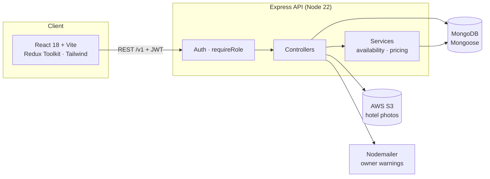

<div align="center">


# DreamStay

**A full-stack hotel booking platform for guests, hotel owners and admins.**

Search hotels by city and dates, see real room availability, and book in a minute.
Owners list and manage their properties; admins keep the platform in order.

[**Live demo →**](https://asura-dreamstay-hotelsite.vercel.app/)


</div>

---

## Features

| Guests | Hotel owners | Admins |
|---|---|---|
| Browse hotels added by owners on the home page | Add hotels with a photo (stored on AWS S3) | View every hotel and every booking |
| Search by city, area or hotel name, dates, rooms and AC / Non-AC | Edit a hotel's details or photo | Remove a hotel (bookings are kept) |
| Only hotels with enough free rooms for those dates are shown | Remove a hotel without losing its booking history | Email a warning to a hotel's owner |
| Book with a live price breakdown; the server computes the final bill | See every booking at their hotels, with guest contact details | Add admins (up to 3) |
| My bookings: upcoming, current and completed stays | | |

Each role has its own sign-in; owners and admins get a dashboard. Every page works in light and dark mode, on desktop and mobile.

## Engineering highlights

- **Role-based access control.** Tokens carry the account's role, and a `requireRole` middleware guards every protected route, so a guest token can't reach owner or admin APIs. Owners can only edit or remove their own hotels. Legacy plain-text admin passwords are upgraded to bcrypt on their next sign-in.
- **Availability engine.** Search and booking share one availability service. A single MongoDB aggregation counts the rooms already booked per hotel and room type for overlapping dates. In a local benchmark (300 hotels, 20,000 bookings) search went from **1,514 ms to 7 ms** and from **116 database operations to 3** per request.
- **No overbooking, no client-side prices.** Bookings are refused with `409` when the rooms are gone, and the bill is always computed on the server.
- **Safe image uploads.** Photos are type- and size-checked (JPG/PNG/WEBP/AVIF, 5 MB), streamed from memory to S3, and the hotel is saved only after the upload succeeds.
- **Soft delete.** Removed hotels disappear from search and listings, but their bookings stay intact and are labelled "Hotel removed".
- **Fast frontend.**
  - Route-level code splitting cut the main bundle from **479 kB to 243 kB**.
  - The hero video loads a poster first and streams the full file on first scroll, so the landing page transfers **3.6 MB instead of 12.6 MB** before scrolling, and its largest content paints in **0.37 s instead of 1.38 s** (measured locally in headless Chrome).
  - Optimized WebP images and long-term caching for build assets.
- **Hardened API.**
  - Input validation with Zod, and search text escaped before it reaches a regex.
  - JSON error responses instead of Express's HTML error pages, and no passwords or keys written to logs.
  - Unique indexes on emails and admin usernames, plus query indexes for bookings and owners.
- **One design system.** A single set of colour, type and spacing tokens (CSS variables + Tailwind) drives every page and both themes.

## Architecture



Frontend on **Vercel**, API on **Render**. For local development, **Docker Compose** runs everything, with MinIO standing in for S3.

## Tech stack

| Layer | Technologies |
|---|---|
| Frontend | React 18, Vite 6, React Router 7, Redux Toolkit, Axios, Tailwind CSS 3, GSAP, Sonner |
| Backend | Node.js 22, Express 4, Mongoose 9, JSON Web Tokens, bcryptjs, Zod, Multer, Nodemailer |
| Storage | MongoDB, AWS S3 (MinIO locally) |
| DevOps | Docker, Docker Compose, nginx, Vercel, Render |

## API

Base URL: `/v1`. Protected routes need `Authorization: Bearer <token>`.

| Method | Route | Access | Purpose |
|---|---|---|---|
| POST | `/user/signup`, `/user/signin` | Public | Guest account |
| GET | `/user/hotels?limit=6` | Public | Newest hotels for the home page |
| POST | `/user/searchHotel` | Public | Hotels with free rooms for a place and dates |
| POST | `/user/bookH` | Guest | Book rooms (409 if full) |
| GET | `/user/mybookings` | Guest | The guest's bookings |
| POST | `/owner/signup`, `/owner/signin` | Public | Owner account |
| POST | `/owner/addhotel` | Owner | Add a hotel with a photo (multipart) |
| PUT | `/owner/updatehotel` | Owner | Edit one of the owner's hotels |
| GET | `/owner/getHotels` | Owner | The owner's hotels |
| DELETE | `/owner/delHotel` | Owner | Remove one of the owner's hotels |
| GET | `/owner/bookings` | Owner | Bookings at the owner's hotels |
| POST | `/admin/signin` | Public | Admin sign-in |
| GET | `/admin/allhotels`, `/admin/getallbookings` | Admin | All hotels / all bookings |
| DELETE | `/admin/deleteHotel` | Admin | Remove any hotel |
| POST | `/admin/sendWarning` | Admin | Email a warning to an owner |
| POST | `/admin/add` | Admin | Add an admin (max 3) |

## Getting started

### Option 1: Docker (everything in one command)

```bash
docker compose up --build
```

| Service | URL |
|---|---|
| App | http://localhost:5173 |
| API | http://localhost:8080/v1 |
| MinIO console (local S3) | http://localhost:9001 (`minioadmin` / `minioadmin`) |

Docker Compose uses throwaway local values; no `.env` is needed.

### Option 2: Run the parts yourself

Requires Node.js 22 and a MongoDB database.

```bash
# API
cd backend
cp .env.example .env      # fill in your values
npm install
npm start                 # or: npm run server (auto-reload)

# Web app (in a second terminal)
cd frontend
cp .env.example .env      # set VITE_B_URL, e.g. http://localhost:8080/v1
npm install
npm run dev
```

## Environment variables

**Backend** ([`backend/.env.example`](backend/.env.example))

| Variable | Required | Purpose |
|---|---|---|
| `MONGO_URL` | yes | MongoDB connection string |
| `SECRET_KEY` | yes | Signs login tokens |
| `AWS`, `AWS_SK` | yes | S3 access key id / secret |
| `CLOUD_DOMAIN` | yes | Public base URL for hotel photos |
| `MAILER_ID`, `MAILER_PASS` | yes | Gmail account and app password for warning emails |
| `PORT` | no | Defaults to `8080` |
| `AWS_REGION`, `S3_BUCKET` | no | Default `ap-south-1` and `projects012` |
| `S3_ENDPOINT` | local only | Points uploads at local MinIO (set by Docker Compose) |

**Frontend** ([`frontend/.env.example`](frontend/.env.example))

| Variable | Purpose |
|---|---|
| `VITE_B_URL` | API base URL, including `/v1` |

## Project structure

```
backend/
  index.js                     app setup, error handler, start-up
  src/
    api/config/                db + S3 clients, schemas, Zod validators
    api/interface/controller/  user, owner, admin, hotel handlers
    api/interface/lib/         auth, requireRole, tokens, passwords, errors, mailer
    api/interface/model/       image upload (Multer → S3)
    api/interface/routes/      route tables per role
    api/services/              availability, pricing
    infrastructure/            env config, router
frontend/
  src/
    Pages/, Model/             pages and page sections
    Components/                navbar, search, forms, dashboards
    Components/ui/             shared design-system components
    lib/                       API setup, session, formatting, store
  tailwind.config.js, src/index.css   design tokens (light + dark)
docker-compose.yml             local stack: MongoDB, MinIO, API, web
```

## Roadmap

- Hotel approval workflow: admins approve new listings before they go live.
- Transactions for bookings, to close the small race window when two guests book the last room at once.
- Pagination for large hotel and booking lists.
- Migration to AWS SDK v3.
- Hero video re-encoded for faster streaming.

## Author

**Rahul Rana** · [GitHub @asura103](https://github.com/asura103) · [Portfolio](https://dev-rahul-rana.vercel.app/)
